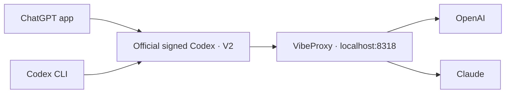

# Local Codex setup

## Routing



App and CLI share `config.toml`: Sol 6.1, high effort, priority tier, and VibeProxy.
[model-catalog.json](model-catalog.json) sets all models to a 350k-token context
limit, with normal compaction at 315k tokens.
Terminal `codex` forwards to the app's official bundled CLI.

## V2 compatibility

VibeProxy's installed CLIProxyAPI 8.0.4 supports this setting in
`~/.cli-proxy-api/config.yaml`:

```yaml
codex:
  optimize-multi-agent-v2: true
```

**The V2 compatibility fix uses this built-in configuration flag.** No proxy
code, Codex binary, or app bundle is patched. It removes task-encryption
annotations, adapts the upstream namespace, and normalizes inter-agent messages.

Codex also needs `features.multi_agent_v2.enabled = true` in `config.toml` and
`multi_agent_version = "v2"` on catalog entries so children receive collaboration
tools. App and CLI use the same settings and official signed backend. No custom
backend or updater remains; app updates preserve this setup. VibeProxy must be
running and authenticated.

The previous locally compiled backend broke the app's native tools because
macOS rejected its signing identity. It has been retired. Existing chats can
retain saved protocol/history; use fresh chats when checking compatibility.

```sh
# Switch both app and CLI to V1 defaults; restart the app afterward.
perl -pi -e 's/"multi_agent_version": "v2"/"multi_agent_version": "v1"/g' ~/.codex/model-catalog.json
codex features disable multi_agent_v2

# Enable V2 again; restart the app afterward.
perl -pi -e 's/"multi_agent_version": "v1"/"multi_agent_version": "v2"/g' ~/.codex/model-catalog.json
codex features enable multi_agent_v2
```

## Streaming

The Codex credential has `websockets: true`, and VibeProxy has
`codex.response-steering: true` for duplex streaming. Astra, Sol, and Luna retain
their upstream `use_responses_lite: true` defaults.

## Compaction

VibeProxy uses [Codex Compact Bridge](https://github.com/patrick-fu/cpa-codex-compact-bridge)
v0.2.0: GPT models use native V2 compaction; other models use text summaries.
The provider name is `OpenAI` to enable native compaction in Codex.
Cross-provider subagents use `fork_turns="none"` with an explicit task brief.
Plugin files and config are in `~/.cli-proxy-api`; installs use the Plugin Store.

## Other custom settings

| Component | Purpose |
| --- | --- |
| `agents/` | Named Fable, Opus, and Gemini roles through VibeProxy |
| [AGENTS.md](AGENTS.md) | Global engineering and communication instructions |
