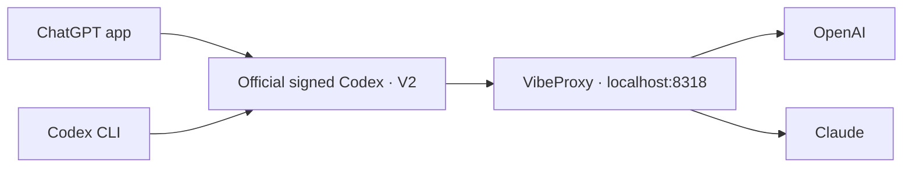

# Local Codex setup

## Routing



App and CLI share `config.toml`: Sol 6.1, high effort, priority tier, and VibeProxy.
[model-catalog.json](model-catalog.json) stores model names and context limits.
Terminal `codex` forwards to the app's official bundled CLI.

## V2 compatibility

VibeProxy's installed CLIProxyAPI 8.0.4 supports this setting in
`~/.cli-proxy-api/config.yaml`:

```yaml
codex:
  optimize-multi-agent-v2: true
```

It removes task-encryption annotations, adapts the upstream namespace, and
normalizes inter-agent messages. `features.multi_agent_v2.enabled = true` in
`config.toml` enables V2 for both app and CLI. No custom backend or updater is
needed. App updates retain their official signed backend; the proxy setting
persists independently. VibeProxy must be running and authenticated.

The previous locally compiled backend broke the app's native tools because
macOS rejected its signing identity. It has been retired. Existing chats can
retain saved protocol/history; use fresh chats when checking compatibility.

```sh
# Switch both app and CLI to V1 defaults; restart the app afterward.
codex features disable multi_agent_v2

# Enable V2 again; restart the app afterward.
codex features enable multi_agent_v2
```

## Other custom settings

| Component | Purpose |
| --- | --- |
| [Idle compaction](idle-compact/README.md) | Compacts eligible chats after 25 idle minutes when the latest request exceeds 100k tokens; requires the app to be running |
| `agents/` | Named Fable, Opus, and Gemini roles through VibeProxy |
| [AGENTS.md](AGENTS.md) | Global engineering and communication instructions |
