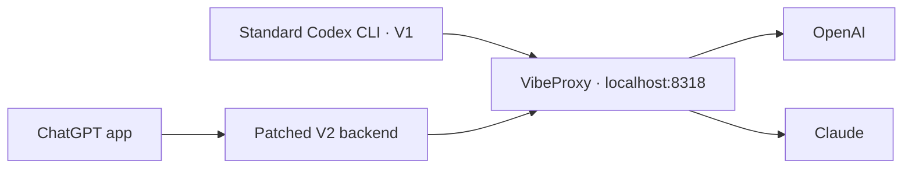

# Local Codex setup

## Routing



OpenAI and Claude both use VibeProxy. The default is Sol 6.1, high effort,
priority tier. Settings live in `config.toml`; model names, context limits, and
compaction thresholds live in [model-catalog.json](model-catalog.json).

VibeProxy must be running and authenticated. Its overrides live in
`~/.cli-proxy-api/config.yaml`. Client → proxy supports WebSockets; Claude's
upstream connection uses HTTP/SSE.

## Plaintext V2 patch

Stock V2 encrypts delegated tasks that Claude cannot read. Our two-file patch
requests plaintext for spawn, messages, and follow-ups while retaining V2
coordination. GPT ↔ Claude tests passed, including a nested GPT → Opus → GPT
chain through the app-server API. Old encrypted history is not decrypted.

| Launch / update | Behavior |
| --- | --- |
| App startup | A login LaunchAgent sets `CODEX_CLI_PATH` to the external launcher |
| Activation | Fully quit and reopen the app; live UI execution still needs verification |
| App update | Files remain in `~/.codex`; a backend version mismatch stops launch |
| New backend version | Rebuild, test, then reopen the app |

```sh
bun ~/.codex/patches/v2-plaintext/rebuild.ts
bun ~/.codex/patches/v2-plaintext/verify-cli.ts
bun ~/.codex/patches/v2-plaintext/verify-app-server.ts
```

Rebuilding is manual. If upstream code changes, the patch may need adjustment.
See the [patch guide](patches/v2-plaintext/README.md) for launch, disable, and
verification details. The standard CLI retains the catalog's V1 default.

## Other custom settings

| Component | Purpose |
| --- | --- |
| [Idle compaction](idle-compact/README.md) | Login service; compacts eligible chats after 25 idle minutes when the latest request exceeds 100k tokens |
| `agents/` | Named Fable, Opus, and Gemini roles through VibeProxy |
| [AGENTS.md](AGENTS.md) | Global engineering and communication instructions |

Idle compaction requires the app to be running. It uses a private desktop
interface, so app updates can affect it.
