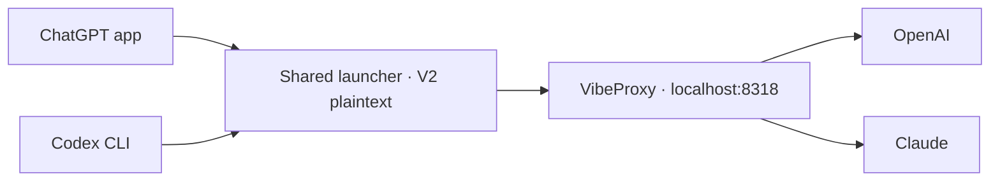

# Local Codex setup

## Routing



OpenAI and Claude both use VibeProxy. The default is Sol 6.1, high effort,
priority tier. App and CLI use the same launcher and settings in `config.toml`;
model names, context limits, and
compaction thresholds live in [model-catalog.json](model-catalog.json).

VibeProxy must be running and authenticated. Its overrides live in
`~/.cli-proxy-api/config.yaml`. Client → proxy supports WebSockets; Claude's
upstream connection uses HTTP/SSE.

## Plaintext V2 patch

Stock V2 encrypts delegated tasks that Claude cannot read. Our two-file patch
requests plaintext for spawn, messages, and follow-ups while retaining V2
coordination. GPT ↔ Claude tests passed, including a nested GPT → Opus → GPT
chain through the app-server API. Old encrypted history is not decrypted.

| Launch / update | Behavior |
| --- | --- |
| Startup | The app uses `CODEX_CLI_PATH`; terminal `codex` uses `~/.codex/bin/codex`. Both call the same launcher |
| Activation | Reopen the terminal and fully quit/reopen the app |
| App update | Automatically applies the patch, builds, and checks app-server startup in the background |
| While updating / on failure | Uses the bundled backend with V1 defaults; details in `patches/v2-plaintext/update.log` |
| Update ready | The next app or CLI launch uses the new patched backend |

```sh
# Disable for app and CLI; fully quit and reopen the app.
~/.codex/patches/v2-plaintext/disable.sh

# Enable for both again; fully quit and reopen the app.
~/.codex/patches/v2-plaintext/enable.sh
```

Automatic checks use no model tokens. If the patch no longer applies or startup
fails, it is not activated. See the [patch guide](patches/v2-plaintext/README.md)
for details. Both use the saved V1 defaults while the patch is disabled or updating.

## Other custom settings

| Component | Purpose |
| --- | --- |
| [Idle compaction](idle-compact/README.md) | Login service; compacts eligible chats after 25 idle minutes when the latest request exceeds 100k tokens |
| `agents/` | Named Fable, Opus, and Gemini roles through VibeProxy |
| [AGENTS.md](AGENTS.md) | Global engineering and communication instructions |

Idle compaction requires the app to be running. It uses a private desktop
interface, so app updates can affect it.
