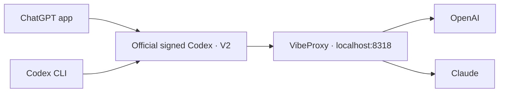

# Local Codex setup

## Routing



App and CLI share `config.toml`: Sol 6.1, high effort, priority tier, and VibeProxy.
`features.api_key_model_discovery = true` keeps older background daemons aligned
with the newer CLI's model-discovery default.
[model-catalog.json](model-catalog.json) sets all models to a 350k-token context
limit, with normal compaction at 315k tokens.
App and terminal `codex` use [bin/codex](bin/codex), which syncs Claude messages
before it starts the official signed CLI in `packages/app-server-daemon/current`.
The login LaunchAgent sets
`CODEX_CLI_PATH` to this launcher; it exits after setting the variable.

Update the shared CLI and background server on the alpha channel:

```sh
npm install -g @openai/codex@alpha
"$(npm prefix -g)/bin/codex" app-server daemon update --from-cli --yes
```

The desktop app uses the updated CLI after its next restart.

## V2 compatibility

VibeProxy uses this setting in
`~/.cli-proxy-api/config.yaml`:

```yaml
client:
  codex:
    optimize-multi-agent-v2: true
```

**The V2 compatibility fix uses this built-in configuration flag.** No proxy
code, Codex binary, or app bundle is patched. It removes task-encryption
annotations, adapts the upstream namespace, and normalizes inter-agent messages.

Codex also needs `features.multi_agent_v2.enabled = true` in `config.toml` and
`multi_agent_version = "v2"` on catalog entries so children receive collaboration
tools. App and CLI use the same settings and official signed backend. No custom
backend or updater remains; app updates preserve this setup. VibeProxy must be
running and authenticated.

The previous locally compiled backend broke the app's native tools because
macOS rejected its signing identity. It has been retired. Existing chats can
retain saved protocol/history; use fresh chats when checking compatibility.


## Browser control

Codex and Claude use `cua_repl` for Chrome and desktop apps.
Playwright MCP is not configured.

## Streaming

The Codex credential has `websockets: true`. Experimental duplex response
steering is enabled with `upstream.codex.response-steering: true`.
Astra, Sol, and Luna retain their upstream `use_responses_lite: true` defaults.

## Compaction

GPT models use OpenAI’s native V2 compaction. Claude models use the built-in
summary compaction in CLIProxyAPI 8.0.22 and later. No compaction plugin or local
patch is needed.
The provider name is `OpenAI` to enable native compaction in Codex.
Cross-provider subagents use `fork_turns="none"` with an explicit task brief.

## Claude tool discovery

On each backend/CLI start, [sync-model-messages.py](bin/sync-model-messages.py)
copies Sol's `model_messages` and app/skill/plugin usage flags to non-OpenAI
catalog entries. The opening sentence becomes “You are Codex, a coding agent.”
OpenAI entries (`gpt-*` and `codex-*`) keep their original messages. It writes
only when values differ. Changes to Sol's catalog entry reach the shared default
on the next start; it does not download new Sol templates.
Opus and Fable use `tool_mode: code_mode_only` and
`supports_search_tool: true`.
Discovery keeps the full tool catalog out of each request. Restart the app after
catalog changes; existing chats use the updated settings when resumed.

VibeProxy loads the upstream [Codex Tool Search Shim prototype](https://github.com/router-for-me/CLIProxyAPI/pull/6140)
v0.4.1, source `cf11b0bebd0722369e1b8e44f6ed4b6360b64750`. It maps Codex's
client search protocol to Claude tools and restores discovered tool identities.
The source was built against the current v8 SDK by changing its v7 imports to v8;
no CLIProxyAPI or VibeProxy version is pinned. Live Opus HTTP and WebSocket
search/call/result checks passed.

Plugin config in `~/.cli-proxy-api/config.yaml` and `merged-config.yaml`:

```yaml
codex-tool-search-shim:
  enabled: true
  priority: 200
  bridge_models: [claude-opus-5-5, claude-fable-5-1]
  max_active_tool_bytes: 2097152
```

For rollback, disable this plugin in the management UI and set
`supports_search_tool` to `false` on both Claude catalog entries, then restart
the app. This restores the full catalog and its large context cost.

## Usage dashboard

[CPA Usage Keeper](https://github.com/Willxup/cpa-usage-keeper) runs at
http://localhost:8080 and appears as **Keeper** in VibeProxy's management center.
Login uses the existing CPA management password. Homebrew starts it at login;
history is stored in `/opt/homebrew/var/cpa-usage-keeper` and uses Central time.
Its private config is `/opt/homebrew/etc/cpa-usage-keeper.env`.
Use `brew services restart cpa-usage-keeper` to restart or
`brew upgrade cpa-usage-keeper` to update, then restart the service.

## Other custom settings

| Component | Purpose |
| --- | --- |
| [Secondwind](secondwind-plugin/README.md) | One shared lossless tool-output compressor; token savings in its sidebar page; no offloading or extra service |
| `agents/` | Named Fable, Opus, and Gemini roles through VibeProxy |
| [AGENTS.md](AGENTS.md) | Global engineering and communication instructions |
